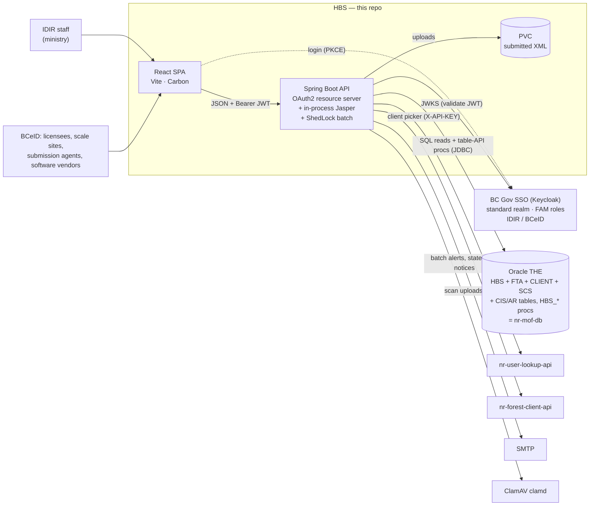

# Architecture

## The one thing to understand first

Like nr-fsp-new, HBS **does not own its data model**. All harvest-billing data
lives in the shared BC Gov Oracle `THE` schema (DDL in the separate
**nr-mof-db** repo), which HBS shares with FTA, CLIENT, SCS, WASTE and the
revenue/AR systems. Unlike FSP, the legacy HBS business rules are **not** in
PL/SQL: the ~460 `HBS_*` procedures are single-table CRUD wrappers, and the
rules lived in ~60–70K lines of EJB code. So the new app splits into two layers:

- **Reads and CRUD writes** — a registry-driven screen layer (reviewed SQL
  ported from the legacy `*Query` classes; writes through the same table-API
  procs the legacy app called). This covers almost every screen.
- **Business workflows** (summarize, price, invoice, cancel/replace, approve
  corrections, sample ratios) — dedicated Java services ported from the legacy
  EJBs. These are being ported incrementally and tracked in
  [legacy-logic-to-port.md](legacy-logic-to-port.md).

## System context



What the legacy system used and what replaces it:

| Legacy | New |
|---|---|
| WebLogic 10.3.6 EAR: Struts 1.1 + EJB 2.x (319 EJBs) | Spring Boot 3.5 / Java 21 API + React 19 SPA (nr-fsp-new stack) |
| WebADE (IDIR/BCeID via Siteminder), 28 roles | BC Gov SSO (Keycloak) + FAM, 28 `HBS_*` roles ([roles-and-security.md](roles-and-security.md)) |
| Crystal → shared JasperReports Server (JCRS) | 79 JCRS units vendored, run in-process ([reports.md](reports.md)) |
| `hbs-batch` remote-EJB client on Windows + AutoMate 5 | ShedLock-coordinated `@Scheduled` jobs in the API pods ([batch-jobs.md](batch-jobs.md)) |
| 12 SMB file shares | PVC + DB settings; FTP/print/Microfiche open ([file-shares-and-storage.md](file-shares-and-storage.md)) |
| log4j SMTP appender | `EmailNotificationService` + Sysdig alerts (monitoring/) |
| Per-JVM LRU reference cache | Spring cache / code-list caching in the SPA |
| `/cli/clientSearch.jsp` client lookup popup | nr-forest-client-api via the backend ([forest-client-integration.md](forest-client-integration.md)) |

## Layers

```
frontend/  React SPA
   screens/areas/*.ts ── ScreenDef registry ──▶ components/screens/{Search,Detail,Form}Screen
   pages/  bespoke: Home, Reports, Submit scale data, Landing, Org select
        │  apiFetch (Keycloak bearer + X-HBS-Active-Org-Client-Number)
        ▼
backend/   Spring Boot API  (package ca.bc.gov.nrs.hbs.api)
   controller/   QueryController (/queries, /commands), HbsReportController,
                 UserApiController, ClientApiController; submission/, queries/…
   query/        QueryRegistry · QueryService · CommandService · Capability
   catalog/      <Area>Catalog — QueryDefinition / CommandDefinition per legacy screen
   security/     Keycloak validators (azp, HBS role), TokenRoles, RoleScope, HbsRoles, HbsAuthorities, HbsAccessGuard
   service/v1/report   HbsReportService (catalog-driven Jasper)
   submission/   P505 XML upload: scan → XSD → transmission → storage
   batch/        BatchConfig (ShedLock), BatchJobRunner, jobs
   dao/v1        AbstractStoredProcedureDao (for bespoke proc DAOs)
   client/       ClamAV, nr-user-lookup-api, nr-forest-client-api
        ▼
Oracle THE   (public synonyms, no schema prefix — same as the legacy app)
```

Shared plumbing is **identical to nr-fsp-new** and was copied from it:
exception handling (`RestExceptionHandler`, `ApiError`, proc-error mapping),
request/response logging (`RequestResponseInterceptor`, `LogHelper`, JSON
log pattern), ClamAV client, nr-user-lookup-api client,
PageableResponse, Hikari/NLS settings, Dockerfile/JVM flags, OpenShift
templates, the Caddy + Coraza WAF frontend image, runtime `config.js`, and the
Carbon UI shell (header, side nav, theme toggle, session timeout, toasts,
federated logout).

## Request flow (a registry search, end to end)

1. SPA `SearchScreen` calls `GET /api/v1/hbs/queries/invoices.search?…&page=0&size=10`.
2. JWT validation (`HbsSecurityConfig`) → authorities `ROLE_HBS_*` (stacked).
3. `@PreAuthorize(ANY_USER)` coarse gate on `QueryController`.
4. `QueryService` looks up the `QueryDefinition`, checks its `Capability`,
   appends only the filters the user filled (each a bound named parameter),
   applies the **client fence** for industry users, binds the FOI viewer
   parameters, runs `COUNT(*)` + `OFFSET/FETCH`, and maps rows to camelCase JSON.
5. Errors: `IllegalArgumentException` → 400 with the field name; Oracle
   errors → curated message or generic 500 (never raw ORA text).

Writes (`POST /api/v1/hbs/commands/{id}`) run one table-API proc with audit
user/timestamps/sequence ids filled server-side, in its own transaction.

## Frontend shape

- `App.tsx` — the nr-fsp-new auth gates (bootstrap → no-role page → org picker →
  app), then `/home`, `/reports`, `/scale-returns/submit`, `/:area` (legacy tab
  landing pages) and `/:area/:screenId` (every registry screen).
- `routes/routePaths.ts` builds the SideNav from the registry: nr-fta's nav
  (one section per legacy tab, an icon per destination, an icon rail when
  collapsed), filtered by capability.
- Pages use nr-fta's page frame and styles (`PageLayout`, `SectionTile`,
  `Tombstone`, `DetailTile`, `styles/_search.scss` / `_detail.scss`) — see
  [screen-framework.md](screen-framework.md#look-and-layout-nr-ftas).
- `pages/HomePage.tsx` is the legacy role-driven work-queue dashboard: each
  legacy home link deep-links into a registry screen with pre-filled criteria.
- See [screen-framework.md](screen-framework.md) for how a screen is declared.

## Deployment

Same as nr-fsp-new: GitHub Actions → GHCR → OpenShift templates
(`backend/openshift.deploy.yml`, `frontend/openshift.deploy.yml`,
`frontend/openshift.route.yml`), PR previews in DEV, merge → TEST → PROD,
Sysdig alerts after PROD. Differences:

- The backend template adds a **ReadWriteMany PVC** for submitted XML
  (`${NAME}-backend-xml-${ZONE}`) and the `HBS_BATCH_ENABLED` switch.
- The **PROD vanity hostname + TLS** is applied by the standalone
  `.github/workflows/route-tls.yml` (workflow_dispatch), never by merge, per
  AGENTS.md. nr-fsp-new embeds it in its deploy instead.
- No FOM integration and no SchemaSpy job (no Postgres).
